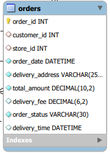
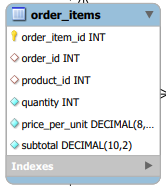
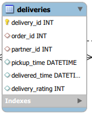

# Project: Zepto Quick Commerce Database

  
  &nbsp;&nbsp;&nbsp;&nbsp;
  

  
  &nbsp;&nbsp;&nbsp;&nbsp;
  

## 1. Introduction

This proposal is relevant to designing a database for a quick commerce application such as Zepto that delivers daily necessities within minutes. This database is created for supporting various operations such as managing clients, processing orders, managing inventory, processing deliveries, and recording payments.

It is kept very simple, organized, and related to real-world business activity.

## 2. Objective of the System

The primary aim of this database is to:

- You can store and manage data related to your products and customers using such  
- Manage inventory at multiple dark stores  
- Process client orders effectively  
- Manage deliveries and delivery partners  

Tip:

This is important for effective coordination of activities between the customers, stores, delivery personnel, as well as the payment systems.

## 3. Scope of the Database

The scope of the database comprises the following functional areas:

- Customer registration and ordering of products/merchants/services  
- Product catalog management  
- Inventory availability at each dark store  
- Breakdown of the order items and billing  
- Delivery partner allocation and delivery tracking  
- Payment type and processing statuses  

## 4. Entities and Their Descriptions

### 1. Customers

It stores basic information of the customers like name, phone number, address, city, and registration date.

### 2. Products

It contains information about products such as the name of the product, category, brand, amount, and description of quantity.

### 3. Dark Stores

These are the fulfillment centers that the company utilizes for distributing products quickly to their consumers.

### 4. Inventory

Keeps stock levels of items that are held at dark stores.

### 5. Orders

It stores information like order number, order date, total amount, delivery charge, order status, and delivery address.

### 6. Order Items

It records minute details of products that are ordered, including their quantity and cost.

### 7. Delivery Partners

Stores information about delivery executives, their allotted stores, type of vehicle, and availability.

### 8. Deliver

Tracks the delivery process including pickup time, delivery time, and customer ratings.

### 9. Payments

It stores information such as payment type, status, transaction ID, and payment time.

## 5. Database Design Logic

La base de datos se estructura sobre un modelo relacional.

A primary key for unique identification is present for each table.

Relationships are maintained by using foreign keys.

Data redundancy is reduced to a great extent using basic normalization techniques.

It is evident that the design embodies the real-world work flow of a quick commerce business.

## 6. Assumptions

- Customers can order multiple times  
- An order belongs to one customer and one dark store  
- One order can contain multiple products  
- A given product may appear in multiple orders  
- Inventory is store-specific  
- It means that for each order, one record of payment is maintained  
- All orders are brought through one delivery partner  

## 7. Conclusion

This database design is effective for the end-to-end functionality of a quick-commerce platform. It allows for the integration of customers, products, stores, delivery, and payments into one organized system, which is ideal for learning purposes or for understanding it in a business context.
